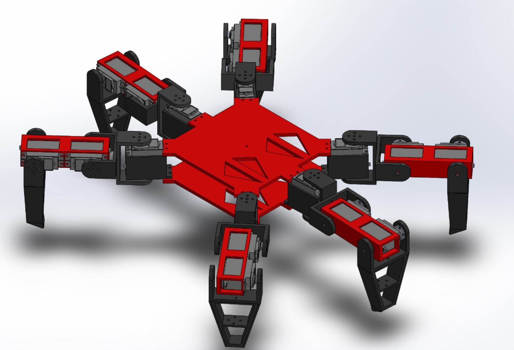

# HEXA_1

This hexapod robot is a versatile and agile robot capable of traversing various terrains and executing complex movements. With its six legs, each equipped with multiple degrees of freedom, it can perform a wide range of tasks including walking, crawling, and climbing.

